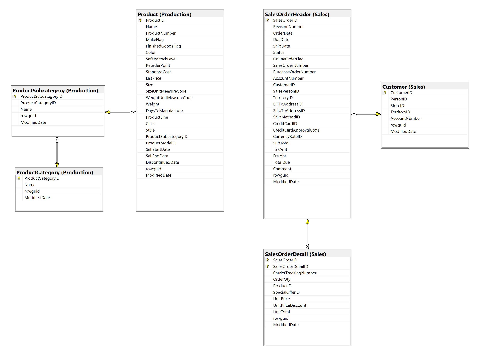

# نمونه‌کار SQL Server با پایگاه داده AdventureWorks

این پروژه با استفاده از پایگاه داده AdventureWorks طراحی شده است و هدف آن نمایش مهارت‌های SQL Server در حوزه تحلیل داده و گزارش‌گیری است.

## مهارت‌های استفاده‌شده

- نگارش کوئری‌های SQL
-INNER JOIN / LEFT JOIN
- GROUP BY و HAVING
-Aggregate Functions
- Subquery
- CTE
- View
- Window Function
- Index
- تحلیل کارایی کوئری‌ها

## بخش‌های پروژه

### تحلیل فروش
بررسی روند فروش در بازه‌های زمانی مختلف.

### تحلیل مشتریان
شناسایی مشتریان برتر و الگوهای خرید.

### تحلیل محصولات
بررسی محصولات پرفروش و محصولات بدون فروش.

### تحلیل درآمد
تحلیل درآمد بر اساس دسته‌بندی محصولات.

### Window Functions
رتبه‌بندی و تحلیل روندها.

### Indexing
نمونه‌هایی از بهینه‌سازی کارایی کوئری‌ها.

## پایگاه داده

AdventureWorks2019

## خروجی‌ها

نمونه خروجی‌ها و نمودارها در پوشه docs قرار دارند.
